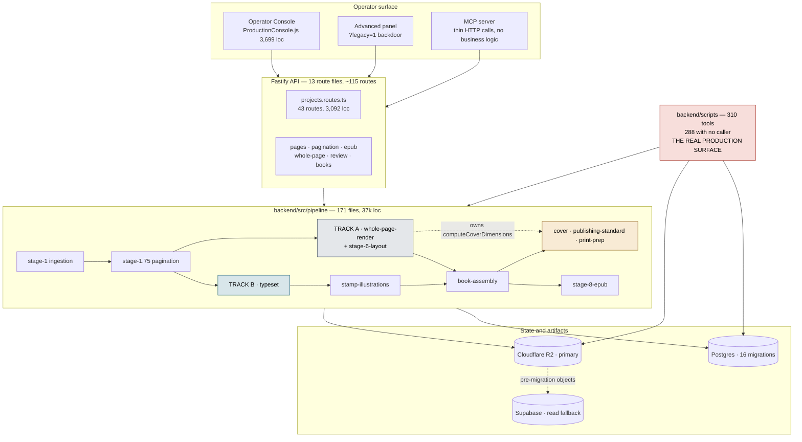
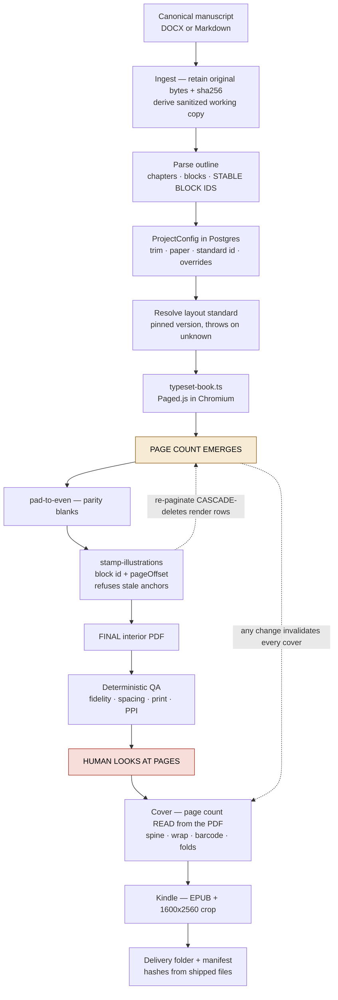
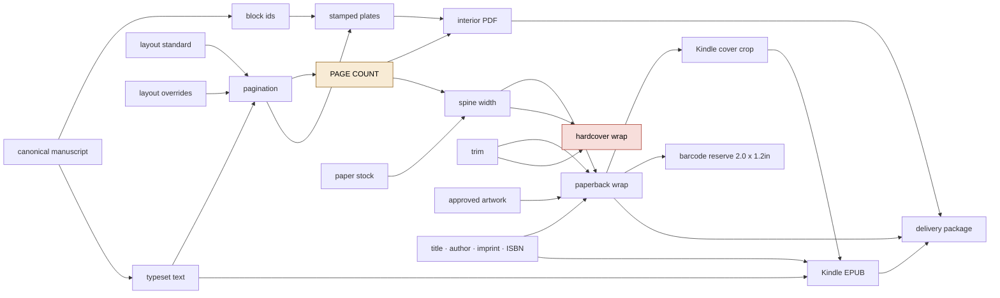
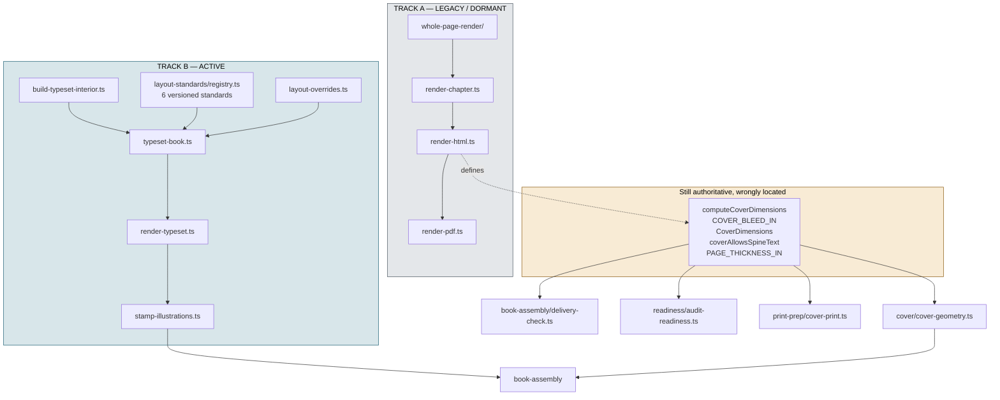
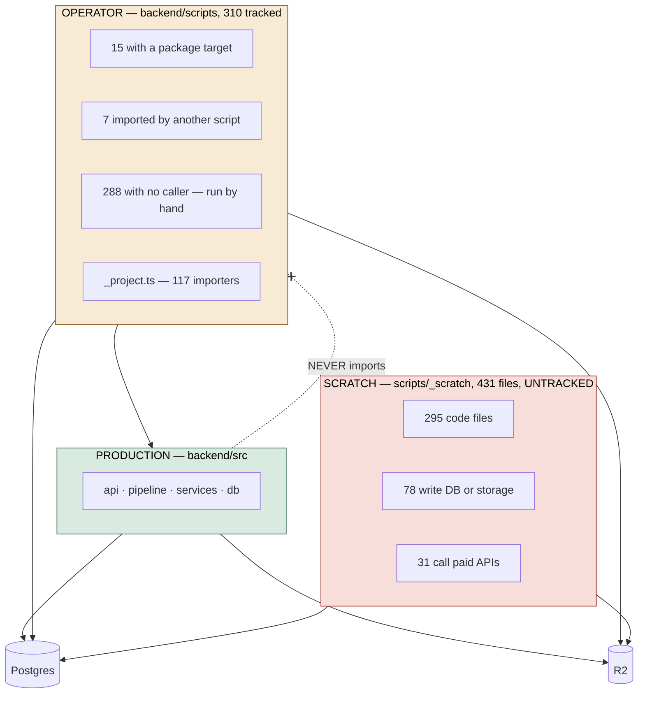

# Architecture

Five diagrams and a subsystem table. The intent is that this document plus the
root README replaces reverse-engineering 310 scripts.

---

## Diagram 1 — System architecture

---

## Diagram 2 — Book-production lifecycle

---

## Diagram 3 — Artifact dependency graph

Page count is the hinge. Everything to its right is invalidated by any change to
its left. Hardcover is red: no verified geometry exists for the current block.

---

## Diagram 4 — Track A / Track B boundary

The amber box is the whole of Track A's live dependency surface: four exported
symbols and one constant table. Moving it out is Phase 1 and is the precondition
for retiring Track A at all. See [LEGACY.md](LEGACY.md).

---

## Diagram 5 — Production vs operator vs scratch

**The one boundary that holds:** `backend/src` imports nothing from
`backend/scripts`, verified by resolved specifiers. Everything else crosses
freely — operator scripts and untracked scratch both reach the production
database and bucket directly.

---

## Subsystems

| Subsystem | Purpose | Entry point | Source of truth | Tested |
|---|---|---|---|---|
| Ingestion | Manuscript in, blocks out | `stage-1-ingestion/ingest-manuscript.ts` | Canonical bytes + sha256 | Partial |
| Pagination | Flow, capacity, rebalance | `stage-1.75-pagination/paginate.ts` | — | **Yes**, 9 suites |
| Typeset (Track B) | Text to paginated PDF | `typeset/build-typeset-interior.ts` | Layout-standard registry | Yes, 10 suites |
| Layout standards | Versioned page design | `layout-standards/registry.ts` | Itself | Yes |
| Layout overrides | Per-block exceptions | `typeset/layout-overrides.ts` | `ProjectConfig` | Yes, 18 assertions |
| Illustration stamping | Plates onto the finished PDF | `typeset/stamp-illustrations.ts` | Block id + `pageOffset` | Partial |
| Cover | Geometry, blueprint, preflight | `cover/cover-geometry.ts` | **Unresolved** — see COVERS-AND-SPINES.md | Maths only |
| Publishing standard | Geometry, style DNA, KDP specs | `publishing-standard/index.ts` | `VERIFIED_SPECS` (hardcover only) | Yes |
| EPUB | Reflowable Kindle output | `stage-8-epub/` | Typeset content | Partial |
| Book assembly | Validate finished files | `book-assembly/delivery-check.ts` | The shipped files | Yes |
| Readiness | Pre-flight project audit | `readiness/audit-readiness.ts` | `ProjectConfig` | Partial |
| Storage | Artifacts | `services/storage/project-storage.ts` | R2, Supabase fallback | Yes |
| MCP | Agent-callable platform | `mcp/server.ts` | The HTTP API | No |
| Frontend | Operator console | `frontend/src/ProductionConsole.js` | — | **No tests** |

---

## Known technical debt, ranked

Reviewed and re-verified 2026-08-26. Every claim below was checked against the
tree rather than carried forward; resolved items are struck out with what closed
them, because a register that only ever grows stops being read.

### P0 — unsafe or actively misleading

1. **The database has no production guard, while storage does.**
   `project-storage.ts` gates on `APP_ENVIRONMENT` and has a dedicated isolation
   test. The database has no equivalent: **18 scripts reach production by
   assigning `process.env.DATABASE_URL`** after the dotenv layers have run, each
   re-implementing its own inline host check, or not. A script with a typo in
   that check writes to production silently. Asymmetric protection is worse than
   none, because the storage guard implies a safety that the database does not
   have. *Fix: one `connectToProduction(reason)` helper that refuses unless
   `APP_ENVIRONMENT=production`, plus a test mirroring the storage one.*

2. **`scripts/` is the production surface and has no design.** 341 tracked (was
   310), **87 of them `_`-prefixed with no caller in code, CI or package.json**
   and no recorded disposition. `_project.ts` is in that same namespace and is
   load-bearing — read by 117 scripts and named in SOURCE-OF-TRUTH.md — so the
   prefix cannot be used to sort scratch from platform. *Fix: disposition the 87
   individually; do not bulk-delete. `docs/archive/HANDOFF_EVERY_PAGE_ILLUSTRATED.md`
   carries a standing operator instruction not to assume these are safe to remove.*

3. **Generic QA tools wear book-specific filenames**, so the next book copies
   rather than calls. `nottm-*` and `dirt-rich-*` are the current examples.

### P1 — real cost, no immediate danger

4. **Two cover blueprints and a third variant**: `src/pipeline/cover/cover-blueprint.ts`,
   `scripts/lib/cover-blueprint.ts`, `scripts/hardcover-blueprint.ts`. Two
   `src/__tests__` files import the *scripts* copy.

5. **`projects.routes.ts` is a 3,096-line god file** with 43 routes.

6. **Frontend is 3,699 lines of untyped, untested JS in one file.**

7. **The maintenance census cannot be regenerated.** `docs/maintenance/*.tsv`
   was machine-generated by a tool that is **not in the repository**, so it has
   drifted (310 rows against 341 scripts) and carries **no rows for
   `backend/scripts/qa/` at all**. *Fix: commit the generator. Do not
   hand-maintain the TSVs — a hand-edited census is worse than a missing one
   because it looks authoritative.*

8. **Unwired code that is documented as if it were live.**
   `cover/spine-band-repair.ts` has zero importers but is named in
   COVERS-AND-SPINES.md, LEGACY.md and SOURCE-OF-TRUTH.md.
   `front-matter/plan-front-matter.ts` is 792 loc implementing
   FRONT_MATTER_V1_SPEC with zero importers. Neither is dead code to delete —
   both are unwired plans. *Fix: say so at the top of each file, or wire them.*

9. **A spec with no implementation.** `qc-text-fidelity/` contains only a SPEC;
   the implementation is a book-named script.

10. **Manifest hashes duplicated** into a check script that must be edited in
    lockstep with the manifest.

### P2 — friction

11. **Four stale git worktrees and 13 local branches**, several on work that has
    since merged or been abandoned (`_np_worktree`, `_wl-rev24-repro`,
    `_wl_remediation`). Each is a full checkout on disk.

12. **Hand-maintained counts in prose rot.** The README's script/loc figures had
    all drifted before this pass. *Fix: derive them, or stop stating them.*

13. Untracked build artifacts at the repository root.

14. Mixed CRLF/LF line endings.

15. 79 of 106 test files sit flat in one directory.

16. **Three tests fail only under full-suite parallel load** (`cover-print`,
    `print-prep`, `pagination.routes.guards`) — each passes in isolation in
    under 1.5 s against a 5 s timeout. Not regressions; the timeout is too tight
    for a 119-file concurrent run.

### P3 — cosmetic

17. `docs/archive/` holds 40+ superseded documents that are still full-text
    searchable, so a grep for a subsystem returns historical claims alongside
    current ones.

### Closed by work already shipped

- ~~Cover geometry has no single authority (five implementations, zero verified
  readings).~~ Closed by the Phase 1B/1C compositor: `cover/compositor/geometry.ts`
  is the one resolver for both bindings, on nine verified Cover Calculator
  fixtures.
- ~~Two live spine-repair implementations.~~ Half closed —
  `stage-6-layout/cover-spine-repair.ts` is the live one;
  `cover/spine-band-repair.ts` now has zero importers and is tracked as P1.8.
- ~~No visual QA gate; Layer 2 was never built.~~ Closed by Phase 3: deterministic
  page/layout QA, raster proofs, contact sheets, evidence-first vision with
  calibration and holdout gates, and deterministic furniture-obstruction
  detection.
- ~~No sanctioned path for a book-local correction.~~ Closed by Phase 2
  (corrections layer) and the Level 1-4 fast path.
- ~~Four tests fail on a clean checkout from absolute paths outside the repo.~~
  Closed. One such test remains and it **skips** when the file is absent
  (`real-manuscript.operator.test.ts`).
