# Architecture — Error Handling & Diagnostics Platform

Companion to `docs/ERROR_HANDLING_STANDARD.md` (the rules) — this doc is the
map: how a request actually moves through the system, end to end, so a new
contributor can find the right file before writing code instead of guessing.

## The whole picture

```mermaid
flowchart TD
    A[Operator action in the console] --> B[fetch via api&#40;&#41; in ProductionConsole.js]
    B --> C{Fastify route}
    C -->|declared Zod schema| D[fastify-type-provider-zod<br/>validates request.body]
    C -->|manual precondition check| E[Route handler logic]
    D -->|invalid| F[registerErrorHandler]
    E -->|throws UserFacingError| F
    E -->|throws raw ZodError&#40;e.g. .parse&#40;&#41;&#41;| F
    E -->|throws generic Error&#40;real bug&#41;| F
    D -->|valid| G[Route handler runs normally]
    G --> H[200 response]

    F --> I{Which shape?}
    I -->|UserFacingError| J[Use its code/errorCode/fields/action as-is]
    I -->|Fastify schema validation| K[issuesToFields + summaryMessage<br/>validation-messages.ts]
    I -->|raw ZodError safety net| K
    I -->|anything else| L[Fastify default serialization<br/>message only, never .stack]

    J --> M[Structured JSON response<br/>error, message, statusCode,<br/>fields, action, errorCode, correlationId]
    K --> M
    L --> N[Generic error response<br/>no fields/action/errorCode]

    J --> O[logTranslatedError]
    K --> O
    O --> P[pino structured log]
    O --> Q[sink&#40;event&#41; calls recordErrorEvent]
    Q --> R[(error_events table)]

    M --> S[Frontend api&#40;&#41; attaches<br/>fields/action/errorCode/correlationId<br/>onto the thrown Error]
    S --> T[Sticky error banner +<br/>LabeledInput field highlighting]
    T -->|has action| U[Recovery button rendered]
    U -->|clicked| V[POST /api/diagnostics/recovery-event<br/>kind: clicked]
    V --> W[(recovery_events table)]
    U --> X[pendingRecoveryRef armed]
    X --> Y[Next run&#40;&#41; outcome]
    Y -->|succeeded| Z[POST /api/diagnostics/recovery-event<br/>kind: succeeded]
    Z --> W

    R --> AA[GET /api/diagnostics/errors]
    W --> AA
    R --> AB[GET /api/diagnostics/renders]
    AA --> AC[DiagnosticsPanel.js<br/>?diagnostics=1]
    AB --> AC
```



## 1. Request flow

Every API call from the console goes through `api()` in
`frontend/src/ProductionConsole.js` — a thin `fetch` wrapper that adds the
`Authorization` header and, on a non-2xx response, builds an `Error` object
carrying `fields`, `action`, `errorCode`, and `correlationId` pulled from the
JSON body (see §5 below). Callers never parse the response body themselves.

On the backend, Fastify routes are declared with an optional `schema` block
(`fastify-type-provider-zod`). If a route declares `schema.body`, invalid
input never reaches the handler — Fastify's validator rejects it before your
code runs. If a route needs a check the schema can't express (a missing
prerequisite, a cross-field rule, a lookup against the database), the
handler throws a `UserFacingError` instead of validating manually and
replying by hand.

## 2. Validation flow

Two independent validation paths feed the same translation layer:

1. **Declarative** — a Zod `schema.body`/`schema.querystring`/`schema.params`
   on the route. Fastify + `fastify-type-provider-zod` reject bad input
   automatically; on failure, `hasZodFastifySchemaValidationErrors()`
   recognizes the shape inside the error handler.
2. **Imperative** — a handler (or something it calls, like
   `assertUsableManuscriptOutline` or `buildDeterministicManifestResult`)
   throws `new UserFacingError(...)` directly, with its own message, code,
   and optional recovery action already attached.

A third shape exists only as a safety net: a raw `ZodError` from a manual
`.parse()` call somewhere that wasn't wrapped in a `UserFacingError`. The
error handler still catches and translates it (§3), but the specific throw
sites we know about (manuscript structure checks) have already been given
real `UserFacingError`s with proper codes and actions — the safety net exists
for whatever the next one turns out to be.

## 3. The translation layer

`registerErrorHandler(app, sink)` (`backend/src/lib/error-handler.ts`) is the
single `app.setErrorHandler()` registered in `server.ts`. It branches on what
was thrown:

| Thrown | Handling |
|---|---|
| `UserFacingError` | Uses its own `code`/`errorCode`/`fields`/`action` — the handler does no reformatting, the throw site already decided the wording. |
| Fastify schema validation failure | `issuesToFields()` + `summaryMessage()` (`validation-messages.ts`) turn every Zod issue into a `{path, label, message, errorCode}`, using `codeForFieldPath()` to look up a code (falling back to `WL-1000`). |
| Raw `ZodError` | Same `issuesToFields()`/`summaryMessage()` path, falling back to `WL-9000` (unclassified) if no field-specific code applies. |
| Anything else | Falls through to Fastify's own default serialization — `{statusCode, error, message}`, **never** `.stack`. This is a real bug, not an operator mistake, so it isn't translated into a friendly message; see `docs/ERROR_HANDLING_STANDARD.md` §1 for why that's a deliberate scope boundary. |

Every branch except the last one calls `logTranslatedError()`, which builds a
`TranslatedErrorEvent` (code, path, method, project id, status, app version,
a fresh `correlationId`) and both logs it and hands it to `sink()`.

## 4. Telemetry flow

`sink` is a callback `registerErrorHandler` takes as its second argument —
this is the seam that keeps `error-handler.ts` unit-testable without a
database (tests pass no sink, or a spy). `server.ts` wires the real one:

```ts
registerErrorHandler(app, (event) => {
  recordErrorEvent(event).catch(() => {});
});
```

`recordErrorEvent()` (`backend/src/db/repositories/error-events.repo.ts`)
inserts a row into `error_events`. This never blocks or can fail the
response — the response was already sent by the time the sink runs.

## 5. Recovery flow

The `correlationId` from step 3 rides along in the JSON response. The
frontend's `api()` helper picks it up onto the thrown `Error`; `run()`
(the wrapper every action goes through) stores it in `errorCorrelationId`
state. When the sticky banner's recovery button is clicked:

1. `POST /api/diagnostics/recovery-event { correlationId, kind: 'clicked' }`
   fires immediately (fire-and-forget).
2. `pendingRecoveryRef` is armed with that `correlationId`.
3. The very next `run()` outcome — success or failure — checks the ref: on
   success it posts `kind: 'succeeded'` for that `correlationId` and clears
   the ref; on failure it just clears the ref (no explicit "failed" event).

This is a **simple heuristic** — "did the next thing the operator did work"
— not a full causal trace back to the specific workflow step that
originally failed. It's cheap, requires no extra state, and is good enough
to notice a recovery button that isn't actually helping (a low success rate
in the diagnostics report is the signal to look closer).

## 6. Diagnostics flow

Three read endpoints, all password-gated like every other route, all
on-demand (no scheduled job, no email — there's no notification
infrastructure in this app to hang one off):

- `GET /api/diagnostics/errors?hours=N` — `getErrorFrequencyReport()`
  aggregates `error_events` (top codes, top paths as a step proxy) and
  `recovery_events` (clicked/succeeded/successRate) for the window.
- `GET /api/diagnostics/renders?hours=N` — `getRenderDiagnostics()`
  aggregates `whole_page_renders` (counts, failures, and two timing
  approximations — see the file's header comment for exactly what's
  precise vs. approximate).
- `GET /api/diagnostics/registry` — the Error Registry as JSON (same data
  as `docs/ERROR_REGISTRY.md`), for any future tooling that wants to
  consume it programmatically.

`frontend/src/DiagnosticsPanel.js` (reached via `?diagnostics=1`, the same
backdoor pattern as `?legacy=1`) is the only consumer today. It is
internal-only — not a customer-facing surface.

## Where to look for what

| I want to... | Look at |
|---|---|
| Add a new user-facing error | `docs/ERROR_HANDLING_STANDARD.md` §3 |
| Understand what a code means | `docs/ERROR_REGISTRY.md` (generated) |
| Change how errors are formatted | `backend/src/lib/validation-messages.ts` |
| Change the response shape | `backend/src/lib/error-handler.ts` — but see the frozen-contracts list first (`ERROR_HANDLING_STANDARD.md` §1) |
| Add a recovery action | The `UserFacingError` throw site — see `ERROR_HANDLING_STANDARD.md` §5 |
| Check what's actually happening in prod | `?diagnostics=1`, or `GET /api/diagnostics/errors` directly |
| Verify nothing leaks | `backend/src/lib/__tests__/error-handling.test.ts` |
