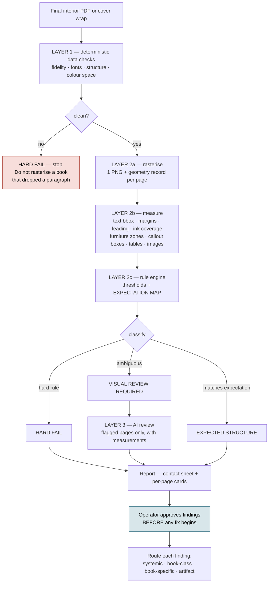

# QA system

What is checked today, what is not, and the shape of the layer that is missing.

> Every defect the owner has found on a shipped book — stranded headings, doubled
> full stops, off-centre plates, a barcode over the copy, an author name hung on
> the trim — **passed every automated check** and was caught by a human looking
> at pages.

---

## Layer 1 — deterministic, exists, works

`scripts/typeset-qa-layer1.ts` (418 loc) is a whole-book deterministic check:
text fidelity, structure, geometry, font embedding. Its own header states it runs
"before Layer 2 begins". **Layer 2 was designed and never built.**

| Tool | What it decides |
|---|---|
| `typeset-qa-layer1.ts` | Fidelity, structure, geometry, fonts, over a whole book |
| `national-parks-fidelity.ts` | Text fidelity: every word survived, marks intact, disclosure verbatim |
| `national-parks-spacing-audit.ts` | Widows, orphans, stranded headings, unexplained gaps, doubled spaces, loose justification, wandering margins |
| `national-parks-print-check.ts` | Trim, annotations, page-box conformance |
| `pdf-image-ppi.ts` | Effective PPI at printed size |
| `pdf-image-centering.ts` | Plate centring against the text block |
| `national-parks-epub-check.ts` | EPUB structure, identity, tables, reflowability |
| `book-assembly/delivery-check.ts` | Finished files against what should have been produced |
| `pdf-page-proof.ts` | **Rasterises pages so a human can look at them** |

Three of these are generic tools wearing a book-specific filename.
`national-parks-spacing-audit.ts` is 380 lines with **two** book references in it.
The next book will copy it rather than call it. Promoting them is Phase 3.

`pdf-page-proof.ts` is the important one for what comes next: it runs pdf.js
*inside Chromium* and screenshots the canvas, because the `canvas` native binding
is unavailable in this environment. That is the hard part of a visual QA system
and it is already solved.

---

## What is not checked

- **Anything visual.** No page is measured or looked at automatically.
- **Composition.** No page-density measurement exists, so an accidental
  near-empty page is indistinguishable from a parity blank.
- **Callout integrity across a page boundary.**
- **Table integrity** beyond the presence of literal pipe syntax.
- **The composed cover.** Geometry maths is tested; the rendered wrap is not.
- **The EPUB's internal cover**, which can go stale independently of the
  delivery folder and has done.

---

## The missing layer

### The expectation map is what makes it work

A naive page checker produces noise because it cannot tell an intentional sparse
page from an accident. **The platform already knows the difference and throws the
knowledge away:** `pad-to-even.ts` knows which blanks are parity blanks, the
layout standard knows which pages are chapter openers, and
`TypesetReport.pageBlocks` knows which blocks landed on which page.

Emit that at typeset time as a per-page record — role, expected furniture,
expected density band — and the rule engine compares each page against what the
book intended rather than against a global average. That single artifact turns
"80% blank page" from a false positive into either "parity blank, expected" or
"chapter ending, review".

### Severity classes

Three, and the distinction matters more than the rules themselves:

- **HARD FAIL** — wrong trim, content outside the page box, clipped text, literal
  Markdown, tofu, RGB in a B&W interior, PPI below 300 at printed size, type
  inside the barcode rectangle, spine text inside fold variance.
- **VISUAL REVIEW REQUIRED** — widows, orphans, stranded headings, leading drift,
  split callouts, tables split mid-record, sparse pages outside their expected
  band, title readability over artwork.
- **EXPECTED STRUCTURE** — parity blanks, part dividers, chapter-opener sinks,
  bleed plates, tables that legitimately continue.

---

## The fixture book

The single highest-leverage missing piece. There is **no book built end to end in
CI**, so a green unit suite coexists with a broken book. Four tests currently fail
on a clean checkout precisely because they reach for real manuscripts at absolute
paths outside the repository — including one under `C:/Users/jovan/Downloads/`.

A fixture book under 20 pages, building in CI in under two minutes, containing
every structure once:

| Element | Guards |
|---|---|
| Chapter opener | Opener layout, folio suppression |
| Normal body pages | Measure, margins, leading drift |
| Parity blank | Furniture leaking onto blanks |
| Table | Literal pipes, overflow, split records |
| Callout spanning pages | Split panels, reopening boxes, orphaned labels |
| Part divider | Sparse-page false positives |
| B&W stamped plate | Colour space, PPI, anchoring, centring |
| Running heads and folios | Literal markup, wrong title, folio drift |
| Sparse chapter end | Density rule tuning |
| Appendix | Back-matter parsing and ordering |
| Paperback cover | Spine from page count, safe zones, barcode |
| Hardcover cover | The **refusal** path — assert it refuses without a verified reading |
| EPUB | Overflow, missing sections, mimetype first and stored |
| Fonts | Type 3, missing embeds, tofu |

The point is not content coverage. It is that **every subsystem appears at least
once**, so a change cannot silently break parsing, pagination, illustrations,
callouts, fonts, colour space, covers or EPUB while the unit suite stays green.

---

## Phasing

| Phase | Work |
|---|---|
| 3.1 | Promote the three book-named QA tools to `src/pipeline/qa/` with a project-based signature |
| 3.2 | Emit the per-page expectation map at typeset time |
| 3.3 | Generalise `pdf-page-proof.ts` into a page-measurement service, cached by PDF hash |
| 3.4 | Rule engine and contact-sheet report. **Ship before any AI is involved** |
| 3.5 | AI review on flagged pages only, under a per-run spend cap |
| 3.6 | Operator approval, and route accepted findings to one of the four fix levels |
