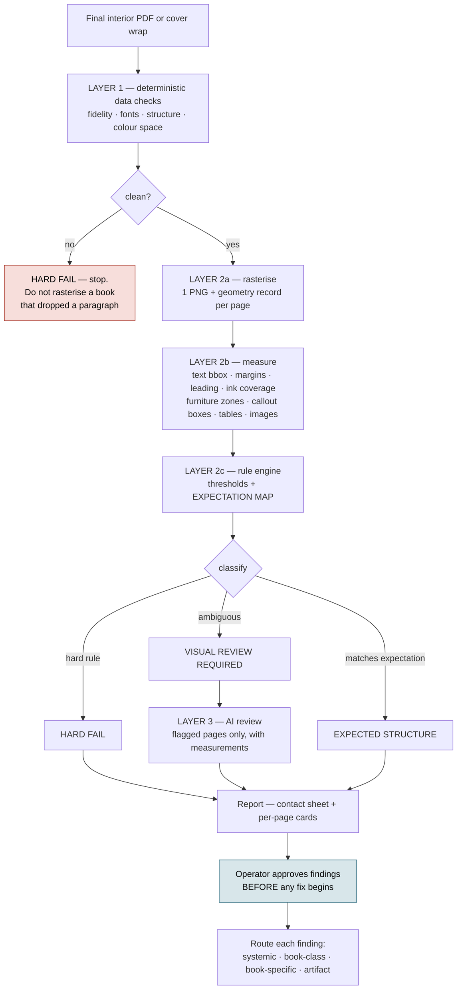

# QA system

What is checked today, what is not, and the shape of the layer that is missing.

> Every defect the owner has found on a shipped book — stranded headings, doubled
> full stops, off-centre plates, a barcode over the copy, an author name hung on
> the trim — **passed every automated check** and was caught by a human looking
> at pages.

---

## Layer 1 — deterministic, exists, works

`scripts/typeset-qa-layer1.ts` (418 loc) is a whole-book deterministic check:
text fidelity, structure, geometry, font embedding. Its own header states it runs
"before Layer 2 begins". **Layer 2 was designed and never built.**

| Tool | What it decides |
|---|---|
| `typeset-qa-layer1.ts` | Fidelity, structure, geometry, fonts, over a whole book |
| `national-parks-fidelity.ts` | Text fidelity: every word survived, marks intact, disclosure verbatim |
| `national-parks-spacing-audit.ts` | Widows, orphans, stranded headings, unexplained gaps, doubled spaces, loose justification, wandering margins |
| `national-parks-print-check.ts` | Trim, annotations, page-box conformance |
| `pdf-image-ppi.ts` | Effective PPI at printed size |
| `pdf-image-centering.ts` | Plate centring against the text block |
| `national-parks-epub-check.ts` | EPUB structure, identity, tables, reflowability |
| `book-assembly/delivery-check.ts` | Finished files against what should have been produced |
| `pdf-page-proof.ts` | **Rasterises pages so a human can look at them** |

Three of these are generic tools wearing a book-specific filename.
`national-parks-spacing-audit.ts` is 380 lines with **two** book references in it.
The next book will copy it rather than call it. Promoting them is Phase 3.

`pdf-page-proof.ts` is the important one for what comes next: it runs pdf.js
*inside Chromium* and screenshots the canvas, because the `canvas` native binding
is unavailable in this environment. That is the hard part of a visual QA system
and it is already solved.

---

## What each pass can actually see

Measurement and looking catch DIFFERENT defects, and each is confidently wrong
about the other's territory. Both were needed to finish one 172-page book.

**Measurement cannot see a bad break.** A page can be 100% full and still be
wrong. One book ended a page on the lead-in `"And separately, and most
importantly:"` with the sentence it introduces — the self-harm instruction —
overleaf. `textFill`, `density`, SPARSE_PAGE and STRANDED_CONTINUATION all judge
HOW MUCH is on a page; that defect was about WHERE the break fell, and nothing
numeric was ever going to raise it.

**Looking cannot see white space.** Contact sheets at thumbnail width do not
reliably distinguish a full page from a half-empty one: five pages were flagged
from the sheets as having large holes and measured 95-98% full, and one page
called out three separate times had 27 body lines and was 4% short. Judge fill
from geometry; use the sheets for STRUCTURE — openers, panels, tables,
illustrations, running heads, folios.

So: sheets for structure, numbers for fill, and full-size renders for anything
either one flags. Never report a whitespace judgement made from a thumbnail.

## What is not checked

- **Anything visual.** No page is measured or looked at automatically.
- **Composition.** No page-density measurement exists, so an accidental
  near-empty page is indistinguishable from a parity blank. PARTLY CLOSED: see
  `STRANDED_CONTINUATION` below, which catches the narrow case of a near-empty
  page carrying a fragment. A page that is merely half-empty is still judged by
  the broken `density` metric.
- **Callout integrity across a page boundary.**
- **Table integrity** beyond the presence of literal pipe syntax.
- **Cross-references.** Nothing compares a printed contents folio against the page
  the section actually landed on. A book that repaginates has every page looking
  correct on its own while the contents points one out — which a visual sweep
  cannot catch by construction. Written for BEFORE YOU NEED IT as
  `scripts/_byni_toc_check.ts` (reads the folios off the printed page, compares
  against `report.sectionStarts`); it is book-specific only because nothing has
  promoted it yet.
- **The composed cover.** Geometry maths is tested; the rendered wrap is not.
- **The EPUB's internal cover**, which can go stale independently of the
  delivery folder and has done.

### `STRANDED_CONTINUATION` — a near-empty page, whatever its role

Added after two pages of BEFORE YOU NEED IT rev-17 shipped through the whole QA
system producing NO FINDING OF ANY KIND — not a defect, and not even the
EXPECTED note that would have proved they were seen.

Two independent faults compounded.

**One: role membership was an unconditional bypass.** Six roles are listed
`SPARSE_BY_DESIGN` and `continue` out of the whitespace check, so `SPARSE_PAGE`
could never fire for them. Two of those roles are assigned without looking at
whether the page is composed:

    PLATE        body.length <= 2 && headings.length === 0
    CHAPTER_END  the NEXT page opens a section

`PLATE` is circular — the page is classified as an illustration plate BECAUSE it
is nearly empty, and plates are then exempt from the nearly-empty check.
`CHAPTER_END` says nothing at all about the page it is applied to.

**Two: the escape hatch was measured with the broken metric.** The `density < 0.5`
gate that would at least have logged them as EXPECTED uses `density`, which
measures how tightly lines are packed WITHIN the span they occupy. Two
consecutive lines on an empty leaf report 1.0. They failed even that.

THE RULE. Fires at REVIEW, before the role bypass, when ALL hold: the page is
not blank; it has no heading; it has three or fewer body lines; its text occupies
under 25% of the text block by BOX GEOMETRY (`textFill`, not `density`); and it
carries no substantial image ink. Conjunctive on purpose — a real plate has
image ink, a parity blank has no body, an opener has a heading, and a composed
ending runs longer than three lines.

REVIEW and never HARD_FAIL: chapters legitimately end short, and a detector that
declares every short page defective is a detector people switch off.

Measured against the whole 175-page book it flagged exactly two pages and
nothing else.

VERTICAL POSITION, ADDED AFTER REVIEW. The text must also START within one line
of the head of the text block. Without it the three-line cap was the ONLY thing
protecting a deliberately composed page, and that is an arbitrary number to rest
on: two pages of this book sat one line the far side of it with the same
emptiness — the approved closing beat (4 lines, textFill 0.127) and the
copyright page (4 lines, 0.129). One more line of manuscript and either would
have been reported as a defect.

Where the text starts separates them cleanly, because it is the actual
difference rather than a proxy for it:

    stranded fragment   starts 0.4% down  — it flowed onto the page
    composed ending     starts  14% down  — someone dropped it there
    copyright page      starts  60% down  — someone placed it there

A page nobody composed begins at the top margin. That is what "leftover"
physically means. The fixture for it is a PAIR — identical content at two
depths — so position is the only variable, and disabling the condition fails
exactly that one test.

SUPPORTING CHANGE. `page-model.ts` gained `images`, `imageAreaFraction` and
`textFill`. The image walk tracks the CTM through `paintFormXObjectBegin`/`End`
as well as save/restore/transform — a form XObject carries its own matrix and
pdfjs emits no separate `transform` for it, so ignoring them measured anything
painted inside a form under the wrong matrix. BEFORE YOU NEED IT contains 26
form XObjects; its seven illustrations sit outside all of them, so the first
version of the walk was right by luck. `getOperatorList()` is also wrapped:
the model previously read TEXT only, and a QA tool that dies on a malformed
content stream is worse than one that reports. `inkBox` is named for everything drawn but had only ever held TEXT,
so a page could carry a full-width illustration and still measure as empty; it
was left alone rather than corrected in place, because `CONTENT_OFF_PAGE` is
calibrated against it.

### Known defect — `PLATE` is assigned from absence, not evidence

    if (p.body.length > 0 && p.body.length <= 2 && p.headings.length === 0)
      return { role: 'PLATE', ... }

"Almost no text" is not evidence of an illustration plate. The page model can
now see images (`imageAreaFraction`), so this could require actual image ink.

NOT DONE. Owner decision on BEFORE YOU NEED IT: a separate platform semantic
change, not to be bundled into a repair. `STRANDED_CONTINUATION` does not depend
on it — it checks image ink itself — so the misclassification is currently
cosmetic in the role tally rather than load-bearing. Revisit if a book appears
where the role itself drives a decision.

### Known defect — `closing-beat` half-centres on ragged-right standards

`layout-overrides.ts` defines the `closing-beat` variant as
`margin-top: 7em; margin-bottom: 0; text-align: center`.

It was authored against `educational-nonfiction-typeset@1`, which sets JUSTIFIED
body text. Every standard from @2 onward is ragged right, which the standards
express with `text-align-last: left`. That declaration survives the variant, so
the block centres every line EXCEPT the last, which snaps flush left. The result
reads as a mistake rather than a treatment.

Reproduced on BEFORE YOU NEED IT rev-17 @4, on two different pages:

    p8    3-line pointer     lines 1-2 centred, line 3 flush left
    p154  2-line lead-in     line 1 centred, line 2 flush left

Second limitation, same variant. Its narrowing rule is keyed to `p` DESCENDANTS
of the block:

    p: 'text-align: center; ... max-width: 22em; margin-left: auto; ...'

A body paragraph block IS a `
`, so it has no `
` descendants and the
narrowing never applies. The variant only fully expresses itself on a block that
wraps its paragraphs — which is the shape it was designed against.

CONSEQUENCE. `closing-beat` is currently unsafe on every book in the educational
line, because they all render on @2 or later. It is not broken in a way that
fails loudly; it produces a page that looks accidentally set.

WORKAROUND IN USE. BEFORE YOU NEED IT treats its one qualifying page with a
bounded `spaceBeforeEm: 6` instead, which achieves the same composition — the
unit dropped clear of the top margin so the page reads as decided — without
touching alignment. That is book-specific and needs no platform change.

Recorded, not repaired: the book had safe treatments available, and changing a
shared variant mid-closeout is the kind of change that wants its own proposal.

---

### Known defect — `densityOf` does not measure page fill

`page-model.ts` documents density as "how full the text block is", and says a page
whose text stops two thirds of the way down reports about 0.66. It does not do
that. The implementation is:

    const capacity = (top - bottom) / norms.leadingPt + 1;
    return Math.min(1, bodySized.length / capacity);

`top` and `bottom` are the first and last BODY LINE. So it measures how densely
lines are packed WITHIN the span they already occupy, and never consults the text
block height or the page. A page whose lines are consecutive reports ~1.0 no
matter how little of the page they cover.

Reproduction, from BEFORE YOU NEED IT rev-17:

| page | body lines | reported density | actual blank |
| --- | --- | --- | --- |
| p8   | 3 | 1.000 | 94% |
| p73  | 4 | 0.977 | 90% |
| p154 | 4 | 0.977 | 90% |

All three are a short paragraph at the top of an otherwise empty leaf. None was
flagged, because nothing measured them.

CONSEQUENCE. "Awkwardly sparse page" is a defect class this QA cannot see, and
`SPARSE_BY_DESIGN` reasoning built on density is reasoning about the wrong number.
The eleven pages filed EXPECTED on this book happened to be correct; that was not
established by the metric.

A correct measure is available from data the model already holds: compare the
text box extent against the text block height, which is page height minus the
standard's top and bottom margins. That is how the sparse pages above were
actually found.

Recorded, not repaired: the fix is a page-model change and the book was closing
out. Scheduled as a beta-platform improvement after the interior is closed.

---

### Known blind spot — `page-audit` does not see table content

`page-model.ts` models the page as text runs at body/heading sizes. Table cells
are neither, so a page carrying nothing but a table measures as empty.

BEFORE YOU NEED IT's back-matter lookup table runs over two pages. `page-audit`
reported them as:

    p162  SPARSE_BY_DESIGN   9% full, correct for a CHAPTER_OPENER
    p163  SPARSE_BY_DESIGN   0% full, correct for a CHAPTER_END

p162 carries a heading, an intro line and thirteen table rows. p163 is a full
page of twenty-two rows. Neither is sparse, and p163 is not blank.

Both were filed EXPECTED, so the report was green about two pages it could not
see. The consequence is not a false alarm but a false silence: a genuinely blank
page inside a table run would be classified the same way and pass.

`repeatHeader` interacts with this. A table that breaks needs its header
repeated, and whether that happened is invisible to the audit for the same
reason — it has to be checked by eye or in the paged DOM.

Recorded rather than fixed: the fix is a page-model change, this book's table was
verified visually instead, and no production path is blocked.

---

### Known blind spot — `typeset-fingerprint-diff` reports a false rewrap

`typeset-fingerprint-diff.ts` decides a block "rewrapped" from the COUNT of its
line boxes (`b.lines.length !== c.lines.length`, then an index-by-index compare).
It never consults `bottomPx`, which the probe already records.

`<wbr>` is a zero-width element, and `getClientRects()` splits a range at inline
element boundaries whether or not the line actually breaks there. So a standard
that adds a long-token policy raises the rect count without moving any type, and
the diff calls that a rewrap.

Reproduction, from BEFORE YOU NEED IT rev-16:

| | @2 | @3 |
| --- | --- | --- |
| rects on block `5b8076dd#0` | 17 | 19 |
| distinct line tops | 11 | 11 |
| `bottomPx` | 274.88 | 274.88 |

Two `<wbr>` were inserted into one 36-character email address, over @3's
28-character threshold. Identical tops and identical bottom edge: the type did
not move. The tool would still call it a rewrap.

This sits on the @2 -> @3 upgrade path that every book in the educational and
trade lines takes, so it will recur. The fix is to treat a rect-count difference
as a rewrap only when the distinct line tops or the bottom edge also differ —
additive, and with no loss of true-positive sensitivity, because identical tops
and bottom edge is what "the type did not move" means.

Recorded rather than fixed: it is a false positive in a diagnostic, it blocks no
production path, and the book that exposed it had load-bearing pagination work
in front of it.

---

## The missing layer

### The expectation map is what makes it work

A naive page checker produces noise because it cannot tell an intentional sparse
page from an accident. **The platform already knows the difference and throws the
knowledge away:** `pad-to-even.ts` knows which blanks are parity blanks, the
layout standard knows which pages are chapter openers, and
`TypesetReport.pageBlocks` knows which blocks landed on which page.

Emit that at typeset time as a per-page record — role, expected furniture,
expected density band — and the rule engine compares each page against what the
book intended rather than against a global average. That single artifact turns
"80% blank page" from a false positive into either "parity blank, expected" or
"chapter ending, review".

### Severity classes

Three, and the distinction matters more than the rules themselves:

- **HARD FAIL** — wrong trim, content outside the page box, clipped text, literal
  Markdown, tofu, RGB in a B&W interior, PPI below 300 at printed size, type
  inside the barcode rectangle, spine text inside fold variance.
- **VISUAL REVIEW REQUIRED** — widows, orphans, stranded headings, leading drift,
  split callouts, tables split mid-record, sparse pages outside their expected
  band, title readability over artwork.
- **EXPECTED STRUCTURE** — parity blanks, part dividers, chapter-opener sinks,
  bleed plates, tables that legitimately continue.

---

## The fixture book

The single highest-leverage missing piece. There is **no book built end to end in
CI**, so a green unit suite coexists with a broken book. Four tests currently fail
on a clean checkout precisely because they reach for real manuscripts at absolute
paths outside the repository — including one under `C:/Users/jovan/Downloads/`.

A fixture book under 20 pages, building in CI in under two minutes, containing
every structure once:

| Element | Guards |
|---|---|
| Chapter opener | Opener layout, folio suppression |
| Normal body pages | Measure, margins, leading drift |
| Parity blank | Furniture leaking onto blanks |
| Table | Literal pipes, overflow, split records |
| Callout spanning pages | Split panels, reopening boxes, orphaned labels |
| Part divider | Sparse-page false positives |
| B&W stamped plate | Colour space, PPI, anchoring, centring |
| Running heads and folios | Literal markup, wrong title, folio drift |
| Sparse chapter end | Density rule tuning |
| Appendix | Back-matter parsing and ordering |
| Paperback cover | Spine from page count, safe zones, barcode |
| Hardcover cover | The **refusal** path — assert it refuses without a verified reading |
| EPUB | Overflow, missing sections, mimetype first and stored |
| Fonts | Type 3, missing embeds, tofu |

The point is not content coverage. It is that **every subsystem appears at least
once**, so a change cannot silently break parsing, pagination, illustrations,
callouts, fonts, colour space, covers or EPUB while the unit suite stays green.

---

## A vision engine already exists

Before designing any of the above, read [VISION-QA.md](VISION-QA.md). There is a
working vision-model QA path in this repository, built for illustration-text
fidelity. Roughly 60% of it is reusable unchanged, and a second Vision stack must
not be built beside it.

## Phasing

| Phase | Work |
|---|---|
| 3.1 | Promote the three book-named QA tools to `src/pipeline/qa/` with a project-based signature |
| 3.2 | Emit the per-page expectation map at typeset time |
| 3.3 | Generalise `pdf-page-proof.ts` into a page-measurement service, cached by PDF hash |
| 3.4 | Rule engine and contact-sheet report. **Ship before any AI is involved** |
| 3.5 | AI review on flagged pages only, under a per-run spend cap |
| 3.6 | Operator approval, and route accepted findings to one of the four fix levels |
