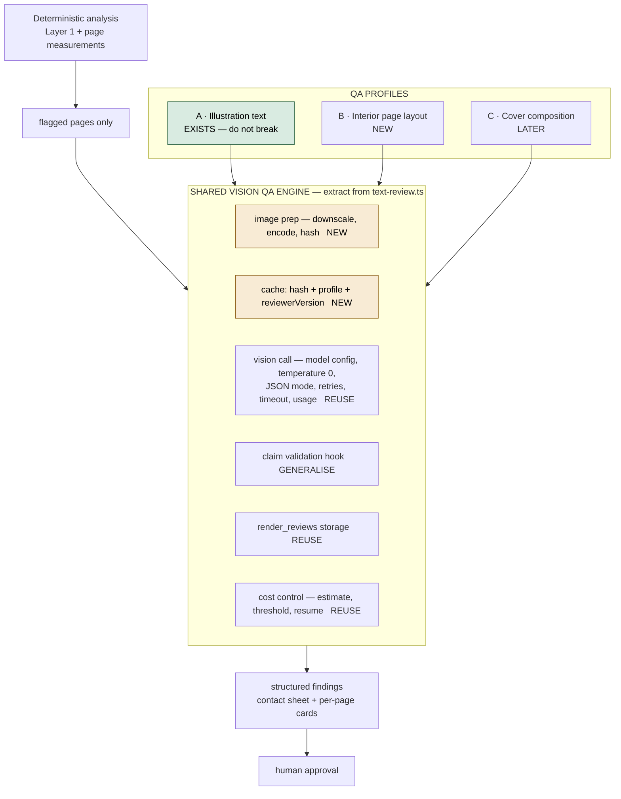

# Vision QA — the engine that already exists

> **Do not build a second Vision stack.** There is a working, well-reasoned
> vision-model QA path in this repository. It was built for one narrow job and
> most of it is not narrow at all.

---

## What it is

Automated **text-fidelity QA on a rendered page image**. It shows a vision model
a finished AI-generated page and the exact source text that should have been
baked into it, and asks where they differ. It exists because Track A bakes
manuscript text into generated artwork, where a misspelling cannot be caught by
string comparison — there is no string, only pixels.

It is little used today because current books typeset real text instead, and
typeset text is verified by comparison, not by looking.

## Where it is

| Piece | Path | LOC |
|---|---|---|
| **The engine** | `backend/src/services/openai/text-review.ts` | 213 |
| Routing policy | `backend/src/services/review-routing/policy.ts` | 202 |
| Export / reporting | `backend/src/services/review-routing/export.ts`, `review-export.service.ts` | 364 |
| HTTP entry | `backend/src/api/whole-page.routes.ts` → `reviewRenderedText` | — |
| Batch driver (API) | `backend/scripts/batch-ai-review.ts` | — |
| Batch driver (local) | `backend/scripts/local-ai-review.ts` | — |
| Calibration | `backend/scripts/vision-calibration.ts` | — |
| Storage | `render_reviews` table, migration `0014_render_reviews.sql` | — |
| Tests | `review-routing/__tests__/policy.test.ts`, `export.test.ts` | — |

## How it works today

| Concern | Implementation |
|---|---|
| Model | `env.OPENAI_REVIEW_MODEL`, a vision chat model. Deliberately **not** a reasoning model. |
| Prompt | Two-step: TRANSCRIBE what is printed, then COMPARE against source. Forcing a transcription first gives the model an anchor instead of pattern-matching to a verdict. |
| Image input | Raw PNG buffer → base64 data URI, `detail: 'high'`. |
| Determinism | `temperature: 0` where the model allows it. |
| Output | `response_format: json_object`, strict shape `{transcription, pass, issues[]}`. |
| Validation | `isSubstantiveClaim()` rejects malformed claims — a claim naming the same word twice, or "correcting" a word the source never contains. Rejected claims are **kept as `suppressedIssues`** for provenance, never as evidence. |
| Versioning | `REVIEWER_VERSION`, bumped when the prompt or model policy changes, with a history log. Lets reconciliation tell "judged by rules we no longer trust" from "actually broken". |
| Cost reporting | Token usage returned per call, because the cost-control policy forbids calling an operation cheap without measuring it. |
| Retries / timeout | `maxRetries: 1`, `timeout: 60_000`. |
| Concurrency | **Sequential by design.** Render-once discipline: one attempt per page, never silent bulk. |
| Cost control | Batch driver states page count and estimated cost (~$0.045/page, measured) and **refuses** above a confirmation threshold. |
| Resumability | Results merge into a report file, so a run resumes rather than restarting. |
| Storage | `render_reviews` — status (`APPROVED` / `ISSUE_FOUND` / `UNCERTAIN`), method (`OPERATOR_MANUAL` / `AI_CHAT` / `AI_API`), findings JSONB, reviewer, timestamp. |
| Routing | One line of arithmetic: readable words ≥ threshold → AI review, else manual. Deliberately auditable by eye. Word count comes from **canonical source text**, never OCR, so a corrupted render cannot change its own routing. |

## Reuse assessment

The owner's nine questions, answered.

| # | Question | Answer |
|---|---|---|
| 1 | What can be reused unchanged? | **Roughly 60%.** The client construction, model configuration, determinism policy, JSON-mode contract, claim-validation guard, reviewer versioning, usage reporting, retry/timeout policy, the `render_reviews` storage shape, and the whole cost-control and resumability pattern in the batch drivers. |
| 2 | What should be generalised? | The **prompt** and the **result shape**. Both currently hardcode one question ("does the printed text match this source?"). They need to become a *profile*: a prompt, a response schema, and a severity mapping, selected per QA job. |
| 3 | What is specific to illustration-text QA? | The `SYSTEM_PROMPT`, the `sourceText` parameter, `transcription`, and `isSubstantiveClaim`'s source-word check. All four assume there is a canonical string the image should reproduce. A page-layout profile has no such string. |
| 4 | Can the response schema support multiple profiles? | **Partly.** `{pass, issues[], usage, model, reviewerVersion}` generalises cleanly. `transcription` is profile-specific and should move into a per-profile payload. `issues[]` as bare strings is the real limit — layout QA needs a location and a severity per finding, not a sentence. |
| 5 | Is the API/model abstraction reusable? | **Yes, and it is the best part.** Model choice from env, temperature 0, JSON mode, usage returned, one retry, 60s timeout, and the reasoning-model branch with its cost reasoning recorded. Lift as-is. |
| 6 | Can rasterised PDF pages use the same image path? | **Yes, with one addition.** It takes a PNG `Buffer`; `pdf-page-proof.ts` already produces exactly that. **There is no resize or compression step**, and `detail: 'high'` on a 300 DPI 6×9 page is a very large image. A downscale-to-review-resolution stage is the one genuinely missing piece. |
| 7 | What deterministic measurements should accompany each page? | Page role and expected density from the expectation map; text-block bbox and margins; line count and leading; ink coverage; furniture zones; callout and table boxes; image boxes with effective PPI and colour space. The model should be asked to judge what it can see, never to measure. |
| 8 | Does it have caching and cost controls? | **Cost controls yes, caching no.** Estimated cost, a confirmation threshold, measured per-call usage, sequential execution, resumable reports. Nothing is keyed by image hash, so re-reviewing an unchanged page pays again. |
| 9 | Does it produce useful visual reports? | **Partly.** `review-routing/export.ts` produces structured exports and `render_reviews` holds findings as evidence. There is no contact sheet and no per-page card with a crop. |

### Verdict

**There is a good shared Vision QA core hidden inside a narrow feature.** It is
not badly structured — it is correctly structured for one profile. The work is
to expose the core, not to hack the feature into doing two jobs.

Three things to extract, in this order:

1. **`visionCall(image, prompt, schema, opts)`** — the model abstraction, the
   determinism policy, JSON mode, usage reporting, retry and timeout. Lift
   almost verbatim from `text-review.ts`.
2. **A profile interface** — prompt, response schema, severity mapping, and a
   claim-validation hook. `isSubstantiveClaim` becomes the illustration-text
   profile's implementation of that hook rather than a global rule.
3. **Two additions that do not exist yet** — an image preparation step
   (downscale, encode, hash) and a cache keyed on that hash plus the profile plus
   the reviewer version.

Everything else — routing, storage, cost control, versioning, resumability — is
already the right shape and should be reused rather than rewritten.

---

## Target architecture

**Profile A — illustration text.** The existing capability. Malformed or
incorrect generated text, spelling fidelity, obvious image defects. Must not
break.

**Profile B — interior page layout.** Input is a rendered page image *plus*
deterministic measurements. Looks for awkward spacing, bad page balance, large
accidental empty regions, widow and orphan appearance, stranded headings, split
callouts, poor table presentation, misplaced illustrations, clipping,
inconsistent furniture, broken symbols, weak chapter-opener composition.

**Profile C — cover.** Front/back/spine composition, safe-zone appearance, spine
readability, barcode-region conflicts, text hierarchy, alignment, image quality.

**The rule for every profile: geometry and measurement stay deterministic. The
model supplies visual judgement only.** It is never asked for a number it could
be wrong about.

**Flag, then look.** Deterministic analysis narrows the set; only flagged pages
reach the model. A full-book visual audit stays available on explicit request.

---

## Roadmap

| Phase | Work |
|---|---|
| **3A** | Audit and generalise the existing Vision QA. Extract the engine, define the profile interface, keep Profile A working. |
| **3B** | Deterministic page-layout QA. Promote the spacing, raster and page-analysis tools out of book-specific scripts into shared platform tooling. |
| **3C** | Interior page Vision profile, on flagged pages. |
| **3D** | Cover Vision profile. Optional, after interior QA is stable. |
| **3E** | Production gate: deterministic + Vision + human approval combined into a READY state. |

Nothing here is built during Phase 0 or Phase 1. This document exists so that a
future engineer finds the existing engine before writing a second one.
